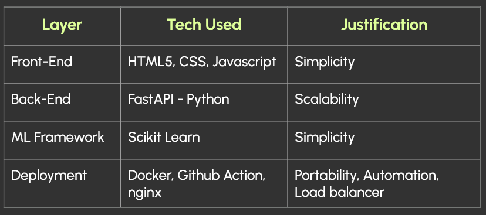
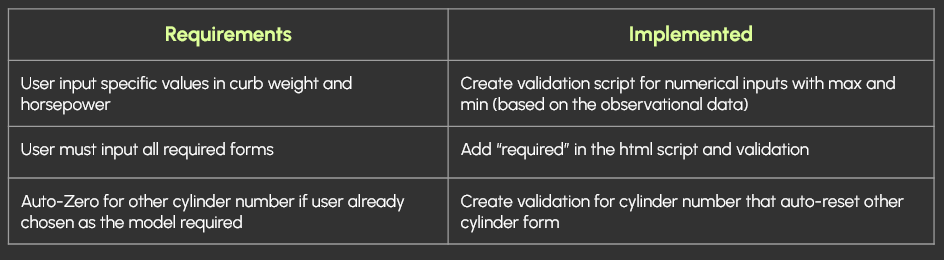
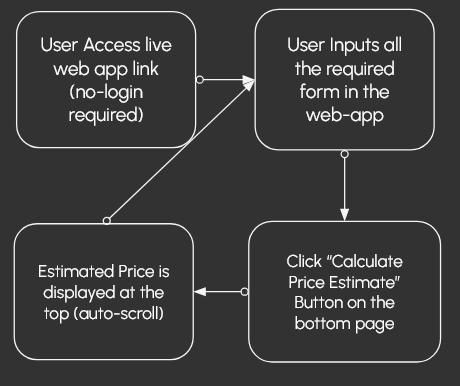

# GEELY AUTO Car Price Prediction for Market Penetration
## Project Intro
This project was submitted for Pelajar Data Deplyocamp course sponsored by Biznet Gio Cloud. We were provided with 3 different problems with 3 different dataset to be solved using machine learning from ingestion, model development to model deployment using Biznet Gio Cloud. For us, team 25, we pick regression dataset with car price prediction. Team25 consist of:
+ Dwi Metaliana P (Machine Learning)
+ M. Bagus R. (DevOps)
+ Brian Prathama (Machine Learning)

## Problem Statement
A Chinese automobile company Geely Auto aspires to enter the US market by setting up their manufacturing unit there and producing cars locally to give competition to their US and European counterparts. They have contracted an automobile consulting company to understand the factors on which the pricing of cars depends. Specifically, they want to understand the factors affecting the pricing of cars in the American market, since those may be very different from the Chinese market. The company wants to know:

- Which variables are significant in predicting the price of a car
- How well those variables describe the price of a car

Based on various market surveys, the consulting firm has gathered a large data set of different types of cars across the America market. 

## Business Goals
We are required to model the price of cars with the available independent variables. It will be used by the management to understand how exactly the prices vary with the independent variables. They can accordingly manipulate the design of the cars, the business strategy etc. to meet certain price levels. Further, the model will be a good way for management to understand the pricing dynamics of a new market. 

# Disclaimer
**The dataset, modelling and deployment done here is for learning purpose only. Do not infer from this project.**

## Solution

+ Use Multiple Linear Regression as interpretable model
+ Use Recursive Feature Elimination with Cross Validation and Variance Inflation Factor to help reduce dimensionality and determine significant factors
+ Build a simple internal web-app for price prediction based on model for internal use

# System Overview Diagram / Architecture

## Tech Stack Table

## Functionality

## User Journey

# Executive Summary
## Purpose
This project aims to discover which significant factors affect pricing of cars in USA based on the observational data.

## Findings
We found that curb weight, horsepower, engine location, OHCV engine, number of cylinders and SPDI fuel system are significant factors in determining price of a car based on our project.

## Audience
This project is intended for Geely internal-use only to be used by marketing, data science and design department

## Recommendations
1. Use above-mentioned factors as keywords in marketing or in designing the car
2. Conduct further data collection to improve model

# DEMO in YouTube
https://github.com/user-attachments/assets/fd2540e5-0267-4ab2-aa09-726f894a73b4
## Live Web App
This web app will be terminated in early September 2025

## Deployment
Step-by-step process:
1. Developer create new release tag
2. New tag will trigger the pipeline
3. Pipeline will create new docker image then push the docker image to hub.docker.com and tagged the image using GitHub repository release tag
4. Replace tag inside docker compose to match the release tag
5. SCP docker compose and nginx config to vm
6. Remote exec docker compose command to deploy the docker compose services

## Scalability Approach
Step-by-step process:
1. On github action page in Container scaler, developer need to run the pipeline manually by entering the number of replicas of the backend service
2. Before applying the change, it will check the value of the input, if:
3. The value is 0, it will set the replica count to 1
4. Other than 0, it will scale the service according the input value

## Maintainability Practice
Log and error still can be only observed directly through docker logs inside the vm

# Outro / What did we learned?
## Technical Challenges
- Making regression model based on classical linear assumption without adding interaction terms or any other transformation, is challenging.
- Researching interpretable model for business and interpret it to make informed decision is challenging (natural vs log-log)

## Future Improvement
1. Create automation pipeline from ingest data to a database and model deployment
2. Create monitoring system for machine learning
3. Create authorization for improved security

## Technical Lesson
1. Tinkering with model in jupyter notebook is only the start, not even half the journey

2. Basic fullstack web development skill is needed to make such a simple web app
3. DevOps skill is critical for automation deployment

## Team Collaboration Insights
Team 25 emphasize on open dialogue and continuous coordination starting from defining business problem, model development and web-app deployment. We help each other to solve technical problems using each of our own expertise.

